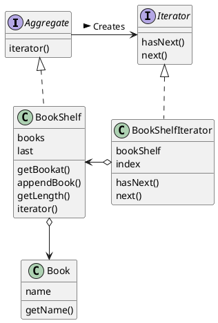

```puml
@startuml
Interface Aggregate {
    iterator()
}

Interface Iterator {
    hasNext()
    next()
}

class BookShelf {
    books
    last
    getBookat()
    appendBook()
    getLength()
    iterator()
}

class Book {
    name
    getName()
}

class BookShelfIterator {
    bookShelf
    index
    hasNext()
    next()
}

Aggregate -> Iterator : > Creates
Iterator <|.. BookShelfIterator
Aggregate <|.. BookShelf
BookShelf <-o BookShelfIterator
BookShelf o--> Book

@enduml
```