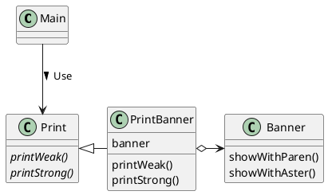

```puml
@startuml

class Main

class Print{
  {abstract} printWeak()
  {abstract} printStrong()
}

class PrintBanner{
  banner
  printWeak()
  printStrong()
}

class Banner{
  showWithParen()
  showWithAster()
}

Main --> Print :> Use
Print <|- PrintBanner
PrintBanner o-> Banner

@enduml
```