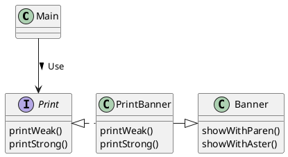

```puml
@startuml

class Main

Interface Print{
  printWeak()
  printStrong()
}

class PrintBanner{
  printWeak()
  printStrong()
}

class Banner{
  showWithParen()
  showWithAster()
}

Main --> Print :> Use
Print <|. PrintBanner
PrintBanner -|> Banner

@enduml
```