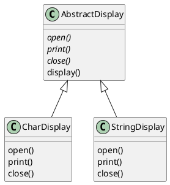

```puml
@startuml

class AbstractDisplay {
  {abstract} open()
  {abstract} print()
  {abstract} close()
  display()
}

class CharDisplay {
  open()
  print()
  close()
}

class StringDisplay {
  open()
  print()
  close()
}

AbstractDisplay <|-- CharDisplay
AbstractDisplay <|-- StringDisplay

@enduml
```