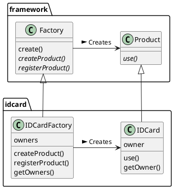

```puml
@startuml

package framework {
  class Factory {
    create()
    {abstract} createProduct()
    {abstract} registerProduct()
  }

  class Product {
    {abstract} use()
  }
}

package idcard {
  class IDCardFactory {
    owners
    createProduct()
    registerProduct()
    getOwners()
  }

  class IDCard {
    owner
    use()
    getOwner()
  }
}

Factory -> Product:> Creates
IDCardFactory -> IDCard:> Creates
Factory <|-- IDCardFactory
Product <|-- IDCard

@enduml
```