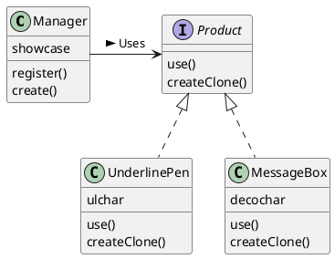

```puml
@startuml

class Manager {
  showcase
  register()
  create()
}

interface Product {
  use()
  createClone()
}

class UnderlinePen {
  ulchar
  use()
  createClone()
}

class MessageBox {
  decochar
  use()
  createClone()
}

Manager -> Product:> Uses
Product <|.. UnderlinePen
Product <|.. MessageBox

@enduml
```