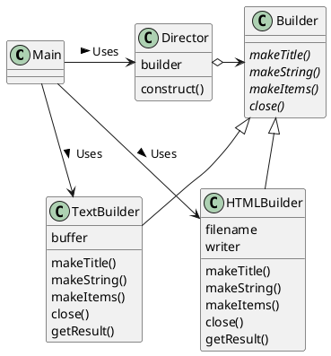

```puml
@startuml

class Main {
}

class Director {
  builder
  construct()
}

class Builder {
  {abstract} makeTitle()
  {abstract} makeString()
  {abstract} makeItems()
  {abstract} close()
}

class TextBuilder {
  buffer
  makeTitle()
  makeString()
  makeItems()
  close()
  getResult()
}

class HTMLBuilder {
  filename
  writer
  makeTitle()
  makeString()
  makeItems()
  close()
  getResult()
}

Main -> Director:> Uses
Main --> TextBuilder:> Uses
Main --> HTMLBuilder:> Uses
Director o-> Builder
Builder <|-- TextBuilder
Builder <|-- HTMLBuilder

@enduml
```